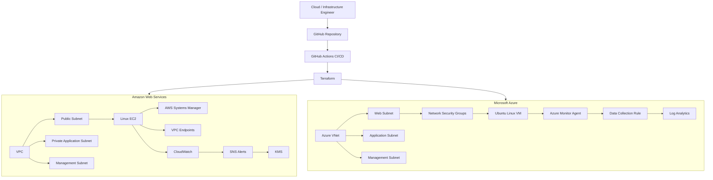

# Hello, I'm Rexmond Anih


## Cloud & Infrastructure Engineer | Systems Engineer | Infrastructure Automation

I am a **Cloud & Infrastructure Engineer / Systems Engineer** with over **8 years of IT experience** across enterprise infrastructure, cloud platforms, identity, endpoint management, networking, systems administration, automation, and technical operations.

My engineering focus is centered on building **secure, automated, observable, repeatable, and maintainable infrastructure** using technologies including **Microsoft Azure, Amazon Web Services (AWS), Terraform, GitHub Actions, Linux, Microsoft Entra ID, Microsoft 365, and Infrastructure as Code**.

I enjoy taking infrastructure through the complete engineering lifecycle:

**Design → Build → Secure → Automate → Validate → Monitor → Document → Operate**

My goal is not simply to deploy cloud resources, but to understand how infrastructure is **architected, secured, automated, monitored, validated, maintained, documented, and managed throughout its lifecycle**.

---

# Cloud & Infrastructure Engineering Portfolio

My hands-on portfolio has progressed from **Azure enterprise infrastructure**, to **high-availability AWS architecture**, and then to a **multi-cloud DevSecOps platform spanning AWS and Microsoft Azure**.

```text
Project 1
Azure Enterprise Infrastructure
        ↓
Project 2
AWS Highly Available Enterprise Architecture
        ↓
Project 3
Multi-Cloud DevSecOps Infrastructure Automation
        ↓
Project 4
Kubernetes & Cloud-Native Platform Engineering
        ↓
Project 5
Enterprise Cloud Platform Engineering
```

---

# Project 1 — Azure Enterprise Infrastructure

**Microsoft Azure • Terraform • Linux • Networking • Monitoring • Backup & Recovery**

A production-style Azure enterprise infrastructure project demonstrating practical cloud infrastructure engineering, secure networking, Linux compute, monitoring, backup/recovery, and Infrastructure as Code.

### Architecture & Infrastructure

- Azure Virtual Network
- Segmented web, application, and management subnets
- Network Security Groups
- Private Linux compute
- SSH public-key authentication
- Secure administrative access
- Azure Storage
- Azure Monitor
- Log Analytics
- Infrastructure monitoring
- Backup and recovery architecture
- Cost-conscious infrastructure management

### Infrastructure as Code

The environment was brought under **Terraform management using a brownfield adoption workflow**.

The project demonstrates:

- Terraform resource imports
- Terraform state management
- Infrastructure dependency management
- Configuration drift detection
- Infrastructure validation
- Git-based change management
- Repeatable infrastructure provisioning

### Engineering Focus

```text
Azure Architecture
      ↓
Secure Networking
      ↓
Linux Compute
      ↓
Terraform IaC
      ↓
Monitoring
      ↓
Backup / Recovery
      ↓
Operational Validation
```

**Repository:** [azure-enterprise-infrastructure](https://github.com/Arex1989/azure-enterprise-infrastructure)

**Status: ✅ COMPLETE**

---

# Project 2 — AWS Highly Available Enterprise Architecture

**AWS • Terraform • Multi-AZ • EC2 • Application Load Balancer • Auto Scaling • IAM • CloudWatch • S3**

A production-style AWS highly available enterprise architecture designed to demonstrate **resilient multi-AZ infrastructure, secure workload deployment, automated scaling, observability, Infrastructure as Code, and resilience testing**.

### Architecture Highlights

- AWS multi-AZ architecture
- VPC networking
- Public and private subnets
- Private EC2 workloads
- Application Load Balancer
- Auto Scaling
- IAM
- CloudWatch
- Amazon S3
- Terraform Infrastructure as Code
- Resilience testing
- High-availability design patterns

### Engineering Focus

```text
AWS VPC
   ↓
Multi-AZ Network
   ↓
Private EC2
   ↓
Application Load Balancer
   ↓
Auto Scaling
   ↓
CloudWatch
   ↓
Resilience Testing
```

The project demonstrates how cloud infrastructure can be designed around **availability, scalability, security, observability, and operational resilience**.

**Repository:** [aws-highly-available-enterprise-architecture](https://github.com/Arex1989/aws-highly-available-enterprise-architecture)

**Status: ✅ COMPLETE**

---

# Project 3 — Multi-Cloud DevSecOps Infrastructure Automation Platform

**AWS • Microsoft Azure • Terraform • GitHub Actions • OIDC • Linux • IAM • Entra ID • CloudWatch • Azure Monitor • DevSecOps**

A comprehensive multi-cloud infrastructure engineering platform designed and implemented across **Amazon Web Services and Microsoft Azure**.

The project demonstrates the complete lifecycle of modern infrastructure — from networking and compute through Infrastructure as Code, CI/CD, federated identity, security hardening, Terraform modularization, observability, troubleshooting, validation, documentation, and controlled infrastructure teardown.

## Architecture



## What I Implemented

- Multi-cloud infrastructure across **AWS and Microsoft Azure**
- Terraform Infrastructure as Code
- Reusable Terraform modules
- AWS VPC architecture
- Azure VNet architecture
- Segmented web, application, and management networks
- Linux compute workloads
- AWS Security Groups
- Azure Network Security Groups
- AWS Systems Manager
- AWS VPC Endpoints
- Secure Terraform remote state
- GitHub Actions CI/CD
- GitHub OpenID Connect federation
- AWS STS authentication
- Microsoft Azure OIDC authentication
- Microsoft Entra ID
- Azure RBAC
- Least-privilege CI/CD permissions
- Infrastructure security scanning
- Security remediation
- AWS CloudWatch
- CloudWatch Logs
- SNS alerting
- AWS KMS
- Azure Monitor Agent
- Azure Data Collection Rules
- Azure Log Analytics
- CPU, memory, and disk telemetry
- Configuration drift validation
- State-aware Terraform refactoring
- Infrastructure lifecycle management
- Controlled AWS teardown

---

## DevSecOps Workflow

```text
Developer
    ↓
Git Commit / Push
    ↓
GitHub Actions
    ↓
OIDC Federation
    ↓
AWS / Azure Authentication
    ↓
Terraform Format
    ↓
Terraform Validate
    ↓
Terraform Plan
    ↓
Security Validation
    ↓
Infrastructure Deployment
    ↓
Monitoring & Observability
    ↓
Operational Validation
```

---

## 11-Phase Engineering Journey

### Phase 1 — AWS Networking Foundation

Established:

- AWS VPC
- Public subnet
- Private application subnet
- Management subnet
- Internet Gateway
- Route tables
- Network routing
- Terraform outputs

### Phase 2 — Terraform CI & IaC Security

Implemented:

- Terraform formatting
- Terraform validation
- Terraform planning
- GitHub Actions CI
- Infrastructure security scanning
- Automated quality gates
- Security remediation

### Phase 3 — GitHub OIDC & Secure AWS CI/CD

Implemented:

- GitHub OIDC federation
- AWS STS
- GitHub Actions IAM role
- Short-lived credentials
- Least-privilege CI access
- Encrypted S3 Terraform backend
- State versioning
- State locking

### Phase 4 — AWS Compute, Systems Management & Private Connectivity

Implemented:

- ARM64 Linux EC2
- EC2 workload deployment
- Encrypted GP3 EBS
- IMDSv2
- IAM instance role
- AWS Systems Manager
- VPC Endpoints
- Nginx
- Application validation

### Phase 5 — Azure Compute & Secure Workload Deployment

Implemented:

- Azure Virtual Network
- Segmented subnets
- Network Security Groups
- Ubuntu Linux VM
- Static public IP
- Network Interface
- SSH public-key authentication
- Managed Identity
- Nginx

### Phase 6 — Azure CI/CD, Identity & Multi-Cloud Integration

Implemented:

- GitHub Actions Azure workflow
- Azure OIDC authentication
- Microsoft Entra ID
- Federated identity
- Azure RBAC
- Terraform remote state
- Automated validation
- Azure CLI verification

### Phase 7 — Reusable AWS Terraform Modules

Refactored AWS infrastructure into reusable Terraform modules covering:

- Networking
- Security

State-aware Terraform migration techniques were used to preserve deployed infrastructure.

### Phase 8 — AWS Security Hardening & CI Validation

Implemented:

- Security remediation
- Restricted network egress
- Terraform state reconciliation
- IaC security validation
- CI revalidation

### Phase 9 — AWS Monitoring, Logging & Observability

Implemented:

- CloudWatch Agent
- CloudWatch Logs
- Nginx logging
- High CPU alarm
- EC2 status monitoring
- SNS notifications
- KMS security controls
- Terraform monitoring module

### Phase 10 — Azure Terraform Modularization

Refactored Azure infrastructure into reusable Terraform modules:

```text
modules/azure/
├── network/
├── security/
└── compute/
```

Terraform `moved` blocks were used to migrate resource state while preserving the live infrastructure.

Final validation confirmed:

```text
Success! The configuration is valid.

0 to add
0 to change
0 to destroy

No changes. Your infrastructure matches the configuration.
```

### Phase 11 — Azure Monitoring, Logging & Observability

Implemented:

- Azure Monitor Agent
- Log Analytics Workspace
- Data Collection Rule
- Data Collection Rule association
- Linux performance counters
- CPU monitoring
- Memory monitoring
- Disk monitoring
- KQL telemetry validation

Final validated telemetry included:

```text
% Processor Time
% Available Memory
% Free Space
```

---

# Infrastructure Troubleshooting & Validation

A significant part of Project 3 involved troubleshooting actual infrastructure behaviour rather than only documenting successful deployments.

During Azure monitoring implementation, disk telemetry was available while CPU and memory metrics required further investigation.

The troubleshooting process included:

- Terraform configuration inspection
- Data Collection Rule inspection
- Azure Monitor Agent inspection
- Generated counter inspection
- Agent log analysis
- Counter definition comparison
- Log Analytics queries
- Corrective Terraform changes
- Reapplication
- Independent telemetry validation

The final implementation successfully exposed:

```text
Processor → % Processor Time
Memory    → % Available Memory
Disk      → % Free Space
```

This demonstrates practical **root-cause analysis, infrastructure troubleshooting, validation, and operational engineering**.

---

# Infrastructure Lifecycle & Cost Management

After final engineering validation, the AWS workload environment was intentionally removed through a **controlled Terraform destruction workflow** to prevent unnecessary ongoing cloud costs.

Before destruction:

```text
No changes. Your infrastructure matches the configuration.
```

A dedicated Terraform destroy plan was reviewed:

```text
Plan: 0 to add, 0 to change, 37 to destroy.
```

Terraform subsequently completed the controlled teardown:

```text
Apply complete!
Resources: 0 added, 0 changed, 37 destroyed.
```

Post-destruction validation confirmed the removal of the AWS workload infrastructure while retaining the required Terraform backend/state evidence.

This demonstrated infrastructure lifecycle management beyond provisioning alone:

```text
Design
   ↓
Build
   ↓
Secure
   ↓
Automate
   ↓
Validate
   ↓
Monitor
   ↓
Operate
   ↓
Document
   ↓
Controlled Teardown
```

**Repository:** [multi-cloud-devsecops-platform](https://github.com/Arex1989/multi-cloud-devsecops-platform)

**Status: ✅ COMPLETE**

---

# Technical Skills

## Cloud Platforms

- Microsoft Azure
- Amazon Web Services (AWS)

## Infrastructure as Code & Automation

- Terraform
- Infrastructure as Code
- Reusable Terraform modules
- Terraform state management
- Terraform remote state
- Terraform import
- State-aware infrastructure refactoring
- Configuration drift detection
- Git
- GitHub
- GitHub Actions
- CI/CD
- Automated infrastructure validation

## Cloud Networking

- AWS VPC
- Azure Virtual Network
- Public and private subnets
- Route tables
- Internet Gateways
- Security Groups
- Network Security Groups
- VPC Endpoints
- DNS
- DHCP
- TCP/IP

## Identity & Security

- Microsoft Entra ID
- Azure RBAC
- AWS IAM
- AWS STS
- GitHub OIDC
- Federated authentication
- Role-based access control
- Least-privilege access
- Infrastructure security scanning
- SSH key authentication
- AWS KMS

## CI/CD & DevSecOps

- GitHub Actions
- Terraform CI/CD
- OpenID Connect federation
- Automated Terraform validation
- Infrastructure security scanning
- Security remediation
- Git-based infrastructure change management
- Short-lived cloud credentials

## Monitoring & Observability

- Azure Monitor
- Azure Log Analytics
- Azure Monitor Agent
- Azure Data Collection Rules
- KQL
- AWS CloudWatch
- CloudWatch Logs
- CloudWatch metric alarms
- SNS alerting
- CPU monitoring
- Memory monitoring
- Disk monitoring

## Systems & Enterprise IT

- Windows
- Linux
- Microsoft 365
- Microsoft Entra ID
- Microsoft Intune
- Active Directory
- Group Policy
- MECM / SCCM
- Endpoint Management
- Enterprise IT Operations
- Infrastructure troubleshooting

---

# Certifications

- **AWS Certified Solutions Architect – Associate**
- **Microsoft Certified: Azure Administrator Associate (AZ-104)**
- **Six Sigma Yellow Belt**

---

# Engineering Principles

My engineering approach is guided by seven principles:

1. **Secure** — security should be part of architecture rather than an afterthought.
2. **Resilient** — infrastructure should tolerate failure and recover predictably.
3. **Observable** — systems should expose meaningful operational metrics and logs.
4. **Maintainable** — infrastructure should remain understandable and manageable after deployment.
5. **Standardized** — repeatable patterns reduce inconsistency.
6. **Operationally Sustainable** — infrastructure should consider supportability and cost throughout its lifecycle.
7. **Adaptable & Flexible** — architectures should evolve as requirements change.

---

# Engineering Roadmap

## ✅ Project 1 — Azure Enterprise Infrastructure

**Status: COMPLETE**

Production-style Azure infrastructure covering secure networking, private Linux compute, Terraform Infrastructure as Code, monitoring, backup/recovery, and operational validation.

---

## ✅ Project 2 — AWS Highly Available Enterprise Architecture

**Status: COMPLETE**

Production-style AWS highly available architecture covering multi-AZ networking, private EC2, Application Load Balancing, Auto Scaling, IAM, CloudWatch, S3, Terraform, and resilience testing.

---

## ✅ Project 3 — Multi-Cloud DevSecOps Infrastructure Automation Platform

**Status: COMPLETE**

An 11-phase AWS + Azure engineering platform covering:

```text
Multi-Cloud Architecture
        +
Terraform IaC
        +
Reusable Modules
        +
GitHub Actions CI/CD
        +
OIDC Federation
        +
Cloud Identity
        +
Security Hardening
        +
Observability
        +
Infrastructure Validation
        +
Lifecycle Management
```

---

## Project 4 — Kubernetes & Cloud-Native Platform Engineering

The next project expands the portfolio from cloud infrastructure into **containerized and cloud-native platform engineering**.

Planned engineering areas include:

- Docker
- Containerization
- Kubernetes architecture
- Pods
- Deployments
- Services
- Kubernetes networking
- Ingress
- ConfigMaps
- Secrets
- Persistent storage
- Helm
- Kubernetes RBAC
- Kubernetes security
- Observability
- CI/CD
- Infrastructure as Code
- Cloud-hosted Kubernetes

Technologies will be moved into the demonstrated skills section after they have been implemented and validated through the project.

---

## Project 5 — Enterprise Cloud Platform Engineering

The final project will build on the capabilities developed through Projects 1–4 and focus on production-style enterprise cloud platform engineering.

Planned engineering areas include:

- Enterprise identity architecture
- Cloud governance
- Hub-and-spoke networking
- Private connectivity
- Private DNS
- Policy and compliance
- Centralized management
- Centralized observability
- Environment separation
- Terraform platform automation
- Policy as Code
- Platform engineering standards

---

# Portfolio End State

The portfolio is designed to progressively demonstrate capability across:

```text
Azure Infrastructure
        +
AWS Infrastructure
        +
High Availability
        +
Systems Engineering
        +
Infrastructure as Code
        +
Cloud Networking
        +
Identity & Security
        +
CI/CD Automation
        +
DevSecOps
        +
Observability
        +
Kubernetes
        +
Cloud-Native Engineering
        +
Enterprise Platform Engineering
```

The objective is to demonstrate the ability to **design, deploy, secure, automate, monitor, troubleshoot, validate, document, operate, and lifecycle-manage cloud infrastructure** while being able to explain the engineering decisions behind it.

---

# Connect With Me

**LinkedIn:** [Rexmond Anih](https://www.linkedin.com/in/rexmond-anih-82294275)

**GitHub:** [Arex1989](https://github.com/Arex1989)
