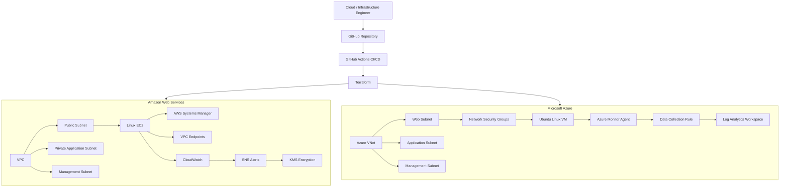

# Hello, I'm Rexmond Anih


## Cloud & Infrastructure Engineer | Systems Engineer | Infrastructure Automation

I am a **Cloud & Infrastructure Engineer / Systems Engineer** with over **8 years of IT experience** across enterprise infrastructure, cloud platforms, identity, endpoint management, networking, systems administration, and technical operations.

My engineering focus is increasingly centered on building **secure, automated, observable, repeatable, and maintainable infrastructure** using **Microsoft Azure, AWS, Terraform, GitHub Actions, Linux, Microsoft Entra ID, Microsoft 365, and Infrastructure as Code**.

I enjoy taking infrastructure through the complete engineering lifecycle:

**Design → Build → Secure → Automate → Validate → Monitor → Document → Operate**

My goal is not simply to deploy cloud resources. I focus on understanding how infrastructure is **architected, authenticated, secured, automated, monitored, troubleshot, maintained, and eventually decommissioned**.

---

# Featured Engineering Project

## Multi-Cloud DevSecOps Infrastructure Automation Platform

**AWS • Microsoft Azure • Terraform • GitHub Actions • OIDC • Linux • CloudWatch • Azure Monitor • DevSecOps**

A hands-on multi-cloud infrastructure engineering platform designed and implemented across **Amazon Web Services and Microsoft Azure**.

The project demonstrates the complete lifecycle of modern cloud infrastructure — from networking and compute deployment through Infrastructure as Code, CI/CD, federated identity, security hardening, Terraform modularization, observability, validation, troubleshooting, and controlled infrastructure teardown.

### Architecture



### What I Implemented

- Multi-cloud infrastructure across **AWS and Microsoft Azure**
- Terraform-managed Infrastructure as Code
- Reusable Terraform modules
- AWS VPC and Azure VNet architectures
- Segmented web, application, and management networks
- Linux compute workloads
- AWS Security Groups and Azure Network Security Groups
- AWS Systems Manager integration
- AWS VPC endpoints
- Secure Terraform remote state
- GitHub Actions CI/CD
- GitHub OpenID Connect federation
- AWS STS authentication
- Microsoft Azure OIDC authentication
- Microsoft Entra ID and Azure RBAC
- Least-privilege CI/CD permissions
- Automated Terraform validation
- Infrastructure security scanning
- Security remediation workflows
- AWS CloudWatch monitoring
- CloudWatch Logs
- SNS alerting
- KMS-backed security controls
- Azure Monitor Agent
- Azure Data Collection Rules
- Azure Log Analytics
- CPU, memory, and disk telemetry
- Infrastructure drift validation
- State-aware Terraform refactoring
- Controlled infrastructure lifecycle management
- Cost-conscious AWS teardown

---

## DevSecOps Workflow

```text
Developer
    ↓
Git Commit / Push
    ↓
GitHub Actions
    ↓
OIDC Federation
    ↓
AWS / Azure Authentication
    ↓
Terraform Format
    ↓
Terraform Validate
    ↓
Terraform Plan
    ↓
Infrastructure Security Validation
    ↓
Infrastructure Deployment
    ↓
Cloud-Native Monitoring
    ↓
Operational Validation
```

---

## 11-Phase Engineering Journey

The Multi-Cloud DevSecOps platform was developed progressively through **11 engineering phases**.

### Phase 1 — AWS Networking Foundation

Established:

- AWS VPC architecture
- Public subnet
- Private application subnet
- Management subnet
- Internet Gateway
- Route tables
- Internet routing
- Terraform outputs
- Infrastructure tagging

### Phase 2 — Terraform CI & IaC Security

Implemented:

- Terraform formatting validation
- Terraform initialization
- Terraform validation
- Terraform planning
- GitHub Actions CI
- Trivy Infrastructure as Code scanning
- HIGH/CRITICAL security quality gates
- Security remediation workflows

### Phase 3 — GitHub OIDC & Secure AWS CI/CD

Implemented:

- GitHub OIDC federation
- AWS STS
- GitHub Actions IAM role
- Short-lived cloud credentials
- Least-privilege CI access
- Encrypted S3 Terraform backend
- Terraform state versioning
- Public-access blocking
- Terraform state locking

### Phase 4 — AWS Compute, Systems Management & Private Connectivity

Implemented:

- Amazon Linux 2023 ARM64
- EC2 web workload
- Encrypted GP3 EBS storage
- IMDSv2
- IAM role and instance profile
- AWS Systems Manager
- S3 Gateway VPC Endpoint
- SSM Interface VPC Endpoint
- SSM Messages Interface VPC Endpoint
- Nginx workload deployment
- HTTP service validation

### Phase 5 — Azure Compute & Secure Workload Deployment

Implemented:

- Azure Virtual Network
- Segmented subnets
- Azure Network Security Groups
- Ubuntu Linux VM
- Static Standard Public IP
- Network Interface
- SSH public-key authentication
- Managed Identity
- Nginx
- Terraform-managed deployment

### Phase 6 — Azure CI/CD, Identity & Multi-Cloud Integration

Implemented:

- GitHub Actions Azure workflow
- Azure OIDC authentication
- Microsoft Entra application
- Service principal
- Federated identity credential
- Azure RBAC
- Azure Terraform remote state
- Automated Terraform validation
- Azure CLI verification

### Phase 7 — Reusable AWS Terraform Modules

Refactored existing AWS infrastructure into reusable modules for:

- Networking
- Security

Terraform state-aware migration techniques were used to preserve deployed resources.

### Phase 8 — AWS Security Hardening & CI Validation

Implemented:

- Security Group hardening
- Restricted network egress
- Terraform state reconciliation
- IaC security remediation
- CI revalidation

The remediation lifecycle followed:

```text
Detect
  ↓
Analyze
  ↓
Remediate
  ↓
Plan
  ↓
Reconcile
  ↓
Apply
  ↓
Verify
  ↓
Re-scan
  ↓
Pass
```

### Phase 9 — AWS Monitoring, Logging & Observability

Implemented:

- CloudWatch Agent
- CloudWatch Logs
- Nginx access logging
- Nginx error logging
- High CPU alarm
- EC2 status-check alarm
- SNS notifications
- Customer-managed KMS encryption
- KMS key rotation
- CloudWatch Logs VPC Endpoint
- Terraform monitoring module

### Phase 10 — Azure Terraform Modularization

Refactored Azure infrastructure into reusable modules:

```text
modules/azure/
├── network/
├── security/
└── compute/
```

Terraform `moved` blocks were used to migrate resource state without destroying or recreating the live infrastructure.

Final validation:

```text
Success! The configuration is valid.

0 to add
0 to change
0 to destroy

No changes. Your infrastructure matches the configuration.
```

### Phase 11 — Azure Monitoring, Logging & Observability

Implemented:

- Azure Monitor Agent
- Log Analytics Workspace
- Data Collection Rule
- Data Collection Rule association
- Linux performance counters
- CPU monitoring
- Memory monitoring
- Disk monitoring
- KQL telemetry validation
- Terraform-managed monitoring module

Final validated counters included:

```text
% Processor Time
% Available Memory
% Free Space
```

---

# Troubleshooting & Engineering Validation

One of the most valuable aspects of this project was troubleshooting infrastructure that did not work correctly on the first attempt.

For example, during Azure monitoring implementation, disk telemetry was initially available while CPU and memory metrics were missing.

The investigation included:

- Inspecting Terraform configuration
- Inspecting the deployed Azure Data Collection Rule
- Inspecting Azure Monitor Agent configuration
- Reviewing generated Linux counter definitions
- Reviewing agent logs
- Comparing configured and effective counters
- Querying Log Analytics directly
- Correcting Linux performance-counter definitions
- Reapplying Terraform
- Revalidating telemetry ingestion

The final result successfully returned:

```text
Processor  → % Processor Time
Memory     → % Available Memory
Disk       → % Free Space
```

This project therefore documents not only successful deployment, but also **real infrastructure troubleshooting and root-cause analysis**.

---

# Infrastructure Lifecycle & Cost Management

After final validation, the AWS workload infrastructure was deliberately removed through a **controlled Terraform destruction workflow** to prevent unnecessary ongoing cloud costs.

Before destruction, Terraform confirmed:

```text
No changes. Your infrastructure matches the configuration.
```

A dedicated destroy plan was generated and reviewed:

```text
Plan: 0 to add, 0 to change, 37 to destroy.
```

Terraform subsequently completed the teardown:

```text
Apply complete! Resources: 0 added, 0 changed, 37 destroyed.
```

Post-destruction AWS CLI validation confirmed the removal of project workload resources including:

- EC2
- EBS
- Elastic IPs
- VPC Endpoints
- CloudWatch alarms
- CloudWatch log groups
- SNS topics
- Project IAM resources
- Workload networking components

The Terraform backend was deliberately retained for infrastructure lifecycle evidence and state history.

This demonstrates the complete infrastructure lifecycle:

```text
Design
   ↓
Build
   ↓
Secure
   ↓
Automate
   ↓
Validate
   ↓
Monitor
   ↓
Operate
   ↓
Document
   ↓
Controlled Teardown
```

---

# Additional Cloud Engineering Work

## Azure Enterprise Infrastructure

Built a production-style Azure infrastructure environment demonstrating:

- Azure Virtual Networks
- Segmented web, application, and management subnets
- Network Security Groups
- Linux virtual machines
- SSH public-key authentication
- Secure administration
- Azure Storage
- Azure Monitor
- Log Analytics
- Infrastructure monitoring
- Backup and recovery concepts
- Terraform brownfield adoption
- Terraform imports
- Terraform state management
- Configuration drift detection
- Infrastructure validation
- Git-based infrastructure change management

---

## AWS Cloud Infrastructure

Implemented AWS infrastructure engineering capabilities including:

- AWS VPC architecture
- Public and private networking
- EC2 Linux workloads
- Security Groups
- IAM
- AWS Systems Manager
- VPC Endpoints
- CloudWatch
- CloudWatch Logs
- SNS
- KMS
- Terraform remote state
- Terraform modularization
- GitHub Actions
- OIDC federation
- Infrastructure security validation

---

# Technical Skills

## Cloud Platforms

- **Microsoft Azure**
- **Amazon Web Services (AWS)**

## Infrastructure as Code & Automation

- Terraform
- Infrastructure as Code
- Reusable Terraform modules
- Terraform state management
- Terraform remote state
- Terraform import
- State-aware infrastructure refactoring
- Configuration drift detection
- Git
- GitHub
- GitHub Actions
- CI/CD
- Automated infrastructure validation

## Cloud Networking

- AWS VPC
- Azure Virtual Network
- Public and private subnets
- Route tables
- Internet Gateways
- Security Groups
- Network Security Groups
- VPC Endpoints
- DNS
- DHCP
- TCP/IP

## Identity & Security

- Microsoft Entra ID
- Azure RBAC
- AWS IAM
- AWS STS
- GitHub OIDC
- Federated cloud authentication
- Role-based access control
- Least-privilege access
- Infrastructure security scanning
- SSH key authentication
- AWS KMS

## CI/CD & DevSecOps

- GitHub Actions
- Terraform CI/CD
- OpenID Connect federation
- Automated Terraform validation
- Infrastructure security scanning
- Security remediation
- Git-based infrastructure change management
- Short-lived cloud authentication

## Monitoring & Observability

- Azure Monitor
- Azure Log Analytics
- Azure Monitor Agent
- Azure Data Collection Rules
- KQL
- AWS CloudWatch
- CloudWatch Logs
- CloudWatch metric alarms
- SNS alerting
- CPU monitoring
- Memory monitoring
- Disk monitoring

## Systems & Enterprise IT

- Windows
- Linux
- Microsoft 365
- Microsoft Entra ID
- Microsoft Intune
- Active Directory
- Group Policy
- MECM / SCCM
- Endpoint Management
- Enterprise IT Operations
- Infrastructure troubleshooting

---

# Certifications

- **AWS Certified Solutions Architect – Associate**
- **Microsoft Certified: Azure Administrator Associate (AZ-104)**
- **Six Sigma Yellow Belt**

---

# Engineering Principles

My infrastructure engineering approach is guided by seven principles:

1. **Secure** — security should be part of architecture rather than an afterthought.
2. **Resilient** — infrastructure should tolerate failure and recover predictably.
3. **Observable** — systems should expose meaningful metrics, logs, and operational information.
4. **Maintainable** — infrastructure should remain understandable and manageable after deployment.
5. **Standardized** — repeatable engineering patterns reduce inconsistency.
6. **Operationally Sustainable** — infrastructure must consider supportability and cost throughout its lifecycle.
7. **Adaptable & Flexible** — architectures should evolve as requirements change.

---

# Engineering Portfolio Roadmap

My portfolio follows a progressive Cloud & Infrastructure Engineering roadmap.

## ✅ Project 1 — Cloud Infrastructure Foundations

Built foundational hands-on experience in cloud infrastructure engineering and infrastructure automation.

## ✅ Project 2 — Azure Enterprise Infrastructure

Developed a production-style Azure environment covering networking, compute, security, monitoring, recovery, and Terraform brownfield adoption.

## ✅ Project 3 — Multi-Cloud DevSecOps Infrastructure Automation Platform

Completed an **11-phase AWS + Azure engineering platform** covering:

```text
Multi-Cloud Architecture
        +
Terraform IaC
        +
Reusable Modules
        +
GitHub Actions CI/CD
        +
OIDC Federation
        +
Cloud Identity
        +
Security Hardening
        +
Observability
        +
Infrastructure Validation
        +
Lifecycle Management
```

**Status: COMPLETE**

---

## 🚧 Project 4 — Kubernetes & Cloud-Native Platform Engineering

The next stage of my engineering roadmap expands into containerized and cloud-native infrastructure.

Planned areas include:

- Docker
- Containerization
- Kubernetes architecture
- Pods
- Deployments
- Services
- Kubernetes networking
- Ingress
- ConfigMaps
- Secrets
- Persistent storage
- Helm
- Kubernetes RBAC
- Kubernetes security
- Observability
- CI/CD
- Infrastructure as Code
- Cloud-hosted Kubernetes

> Kubernetes-related technologies will move into my demonstrated technical skills only after they have been implemented and validated through the project.

---

## 🔜 Project 5 — Enterprise Cloud Platform / Landing Zone

The final planned portfolio project will focus on production-style enterprise cloud platform engineering.

Planned areas include:

- Enterprise identity architecture
- Cloud governance
- Hub-and-spoke networking
- Private connectivity
- Private DNS
- Policy and compliance
- Centralized management
- Centralized observability
- Dev / Test / Production architecture
- Terraform platform automation
- Policy as Code
- Platform engineering standards

The objective is to integrate the capabilities developed across Projects 1–4 into an enterprise-style cloud platform.

---

# Portfolio End State

The roadmap is designed to progressively develop practical capability across:

```text
Cloud Infrastructure
        +
Systems Engineering
        +
Infrastructure as Code
        +
Cloud Networking
        +
Identity & Security
        +
CI/CD Automation
        +
DevSecOps
        +
Observability
        +
Kubernetes
        +
Cloud-Native Engineering
        +
Enterprise Platform Engineering
```

My goal is to demonstrate the ability to **design, deploy, secure, automate, monitor, troubleshoot, document, operate, and lifecycle-manage cloud infrastructure — while clearly explaining the engineering decisions behind it.**

---

# Connect With Me

**LinkedIn:** [Rexmond Anih](https://www.linkedin.com/in/rexmond-anih-82294275)

**GitHub:** [Arex1989](https://github.com/Arex1989)
